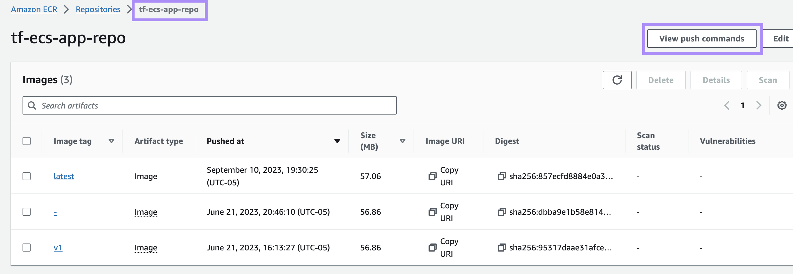

1. Build container image and run it locally

```
cd app_frontend
docker build -t tf-ecs-app-repo .
docker run -p 5000:5000 --name tf-ecs-app tf-ecs-app-repo
```

2. See app running locally at `http://localhost:5000`

3. Stop and remove container

```
docker stop tf-ecs-app
docker rm tf-ecs-app
```

3. Upload image to the Amazon Elastic Container Registry (ECR)

-   Log into the AWS console, navigate to ECR and select the `us-east-1` region so the image will be in the same region as your ECS infra to be deployed via Terraform.
-   Create ECR repo named `tf-ecs-app-repo`
-   In `tf-ecs-app-repo`, select "Push Commands" and follow instructions to build/push the image to ECR
    
